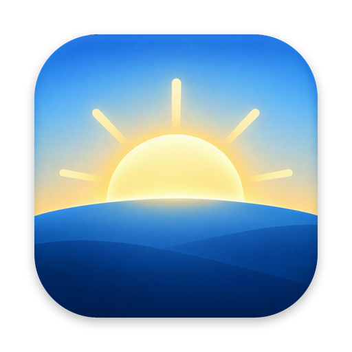

<p align="center"></p>

<h1 align="center">First Light</h1>

<p align="center">A calm first look at your day, for the Mac.<br>Your inboxes, calendars, to-dos, the weather and a personal news brief, in one window.</p>

---

## What it does

- **Combined inbox.** Connect as many Gmail, iCloud, Outlook, Yahoo or other IMAP accounts as you like. Today shows priority mail only; the Mail tab lets you view every inbox, just priority, or one account at a time.
- **Combined calendar.** Google Calendar and any iCal link, merged into one day. Duplicate invites show once, clashes are flagged, and the next meeting gets a Join button when it has a Meet, Zoom or Teams link.
- **Morning brief.** Describe what you want to hear about in plain English. Each morning First Light collects headlines from Google News and any RSS feeds you add, then Claude writes a short brief with sections, a watchlist and a thought for the day.
- **To-do list,** with due dates, stars, and one-click "turn this email into a task".
- **Weather** and a Dock badge for unread mail.
- A Liquid Glass interface that follows light and dark mode.

## Privacy

Everything runs on your Mac. There is no First Light server.

- Email and calendar data go straight from your provider to your Mac and are never sent anywhere else. Access is read-only.
- Sign-in tokens, app passwords and your Anthropic API key are encrypted with the macOS Keychain.
- The only thing sent to Anthropic is the list of news headlines and your brief preferences.

See [PRIVACY.md](PRIVACY.md).

## Install

1. Download the latest `First-Light-mac-arm64.zip` (Apple silicon) or `First-Light-mac-x64.zip` (Intel) from [Releases](../../releases).
2. Unzip it and drag **First Light** into Applications.
3. The first time, macOS may say it can't verify the developer. Open **System Settings → Privacy & Security** and click **Open Anyway**. (Signed and notarised builds are planned.)

### What you need

- macOS 13 or later.
- An **Anthropic API key** for the morning brief ([platform.claude.com](https://platform.claude.com/settings/keys)). The brief uses Claude Haiku and a single request a day, which typically costs about one to three US cents. The app shows the exact tokens used under Settings → Claude.
- For Gmail without Google sign-in, an **app password** (Google Account → Security → 2-Step Verification → App passwords). iCloud, Outlook.com and Yahoo work the same way.

## Google sign-in

"Continue with Google" needs a Google Cloud OAuth client. Release builds include one. If you build from source you need your own:

1. In [Google Cloud](https://console.cloud.google.com), create a project and enable the **Gmail API** and **Google Calendar API**.
2. Set up the OAuth consent screen (Google Auth Platform). For personal use choose **External** and add yourself as a test user.
3. Create an OAuth client of type **Desktop app** and download its JSON.
4. Save it as `src/google-client.json` (see `src/google-client.example.json`). It is ignored by git.

Without this file the app still works: use **Continue with email**, add mailboxes with app passwords, and add calendars with iCal links.

## Build from source

```bash
git clone https://github.com/olliehippo/first-light.git
cd first-light
npm install
npm start            # run in development
npm run pack         # build out/First Light-darwin-arm64/First Light.app
ARCH=x64 npm run pack   # Intel build
```

Releases are built by GitHub Actions (`.github/workflows/release.yml`) when a `v*` tag is pushed.

## How it's built

Electron, with no framework on the front end.

| File | Purpose |
| --- | --- |
| `src/main.js` | Window, storage, scheduling, accounts and the Anthropic request |
| `src/google.js` | Google sign-in (PKCE with a loopback redirect), Gmail and Calendar |
| `src/mail.js` | IMAP mailboxes |
| `src/feeds.js` | Collects headlines from Google News and RSS |
| `src/prompt.js` | Turns your description into a plan, and the plan into a brief |
| `src/renderer.js`, `src/styles.css` | The interface |

## Notes

- Google News RSS is provided for personal feed readers. First Light fetches it from each user's own Mac for their own use.
- News summaries are written by Claude from headlines and can contain mistakes. Every item links to the original story.

## Licence

MIT. See [LICENSE](LICENSE).
